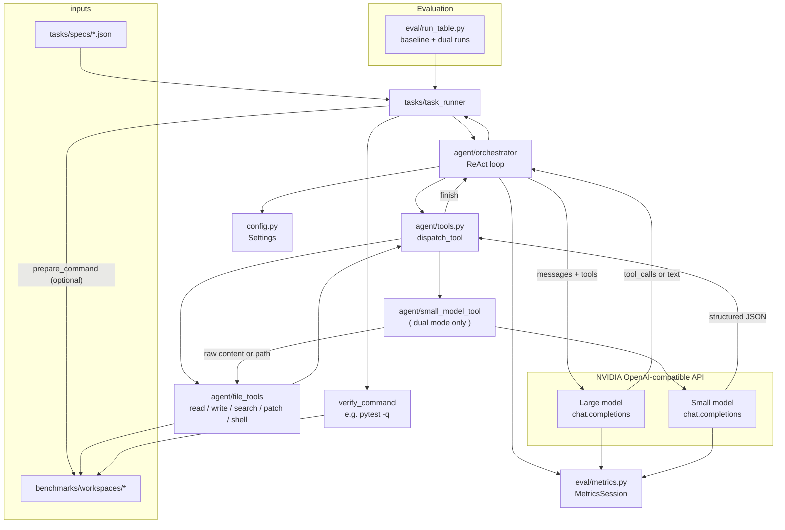

# Coding agent (context-optimised dual model)

A **ReAct-style coding agent** where a **large** NVIDIA NIM model plans and edits, and a **small** model runs as a **tool** to shrink bulky text (logs, large files, traces) into structured JSON so the orchestrator’s context stays small.

## Architecture



## Requirements

- Python 3.10+ (3.11+ recommended)
- [NVIDIA API key](https://build.nvidia.com) with access to your chosen models on the OpenAI-compatible endpoint

## Setup

```bash
cd coding_agent
pip install -r requirements.txt
cp .env.example .env
```

Edit `.env`:

- **`NVIDIA_API_KEY`** — required  
- **`NVIDIA_BASE_URL`** — default `https://integrate.api.nvidia.com/v1`  
- **`LARGE_MODEL` / `SMALL_MODEL`** — exact `model` strings from each model’s **API** snippet on [build.nvidia.com](https://build.nvidia.com) (e.g. `meta/llama-3.1-8b-instruct`).  
  Do **not** use a Build “function” UUID as `model`. If you see **404** `Function '<uuid>' not found`, that slug is not entitled for your key — pick another model id from the catalog.

Optional: set per-1M token prices for cost estimates in metrics (`*_PRICE_PER_M`).

## Run a single task

From `coding_agent/`:

```bash
python -m tasks.task_runner tasks/specs/task_bugfix.json dual
python -m tasks.task_runner tasks/specs/task_bugfix.json baseline
```

- **`dual`** — large model + `small_model_tool`; large `read_file` refuses very long files (use `small_model_tool` with `payload.path` or `payload.content`).  
- **`baseline`** — same tools **without** `small_model_tool`; full `read_file` for comparison runs.

## Run the full eval table (baseline vs dual)

Runs all specs in both modes (six agent runs — uses API quota):

```bash
python -m eval.run_table
```

## Project layout

| Path | Role |
|------|------|
| `config.py` | Env-driven settings and model validation |
| `agent/orchestrator.py` | Large-model loop, tool calls, usage logging |
| `agent/tools.py` | Tool schemas + dispatch |
| `agent/small_model_tool.py` | Small model: typed ops, JSON-shaped replies |
| `agent/file_tools.py` | Read/write/search/run/patch under workspace |
| `tasks/task_runner.py` | Load JSON spec → agent → `verify_command` (e.g. pytest) |
| `tasks/specs/*.json` | Task definitions |
| `eval/metrics.py` | Token/cost/session metrics + markdown table helper |
| `eval/run_table.py` | Batch baseline + dual runs |
| `benchmarks/workspaces/*` | Small multi-file workspaces for bugfix / feature / refactor |
| `WRITEUP.md` | Framing + design notes for reports |

## Task spec format (`tasks/specs/*.json`)

- **`workspace`** — path relative to the spec file (usually under `benchmarks/workspaces/`)  
- **`prompt`** — user message to the agent  
- **`verify_command`** — argv list; success requires exit code `0` and `finish(success=true)`  
- **`prepare_command`** — optional argv run before the agent

## Contributing / PRs

Use a short-lived **feature branch** off `main`, push it, and open a PR back to `main`. For a ready-made title, summary, and test-plan checklist you can paste into GitHub/GitLab, see **`docs/PULL_REQUEST.md`**.

## License

Use and modify for your evaluation and coursework; add a license file if you redistribute publicly.
